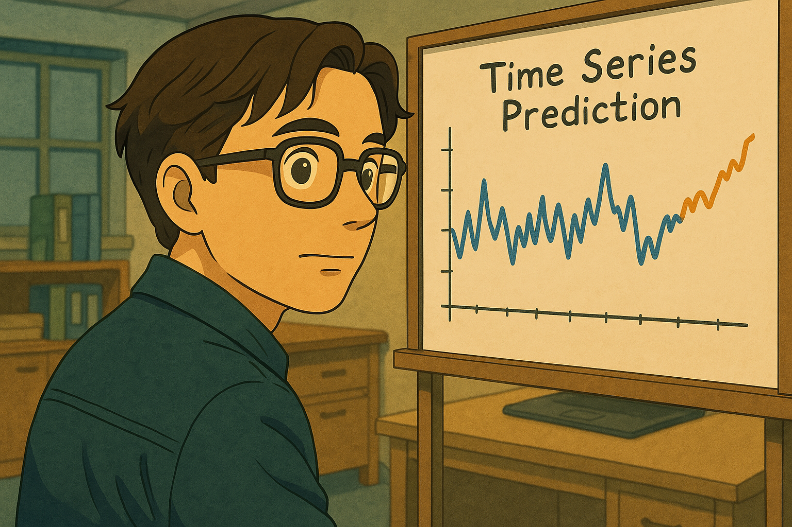

# Clase Energias Renovables

2025

El objetivo de este núcleo es comparar diferentes arquitecturas de redes neuronales profundas (+XGBoost) en la tarea de predecir el CONSUMO TOTAL de la próxima hora utilizando los valores pasados del precio de la electricidad así como los de otras características relacionadas con la generación de energía y las condiciones meteorológicas. Además, el núcleo contiene una exploración y limpieza meticulosa de los datos, análisis de series temporales del precio de la electricidad y una ingeniería de características cuidadosa. Con más investigación y desarrollo (por ejemplo, como un modelo de pronóstico que se actualiza en tiempo real) un enfoque similar podría resultar útil para todos los interesados (compañías de energía eléctrica, inversores, etc.) involucrados en los mercados energéticos.

En el proyecto, comparé el rendimiento (utilizando el Error Cuadrático Medio Raíz como la métrica de rendimiento) de 3 arquitecturas diferentes (XGBoost, LSTM y RNN) para pronósticos multivariados (es decir, usando solo los pasos de tiempo anteriores del precio de la electricidad vs. también usando otras características) utilizando un número diferente de pasos de tiempo anteriores como las características para los modelos (24, 168 y 336 pasos de tiempo anteriores para todas las características utilizadas).

En esta ANN particular, encontrarás una aplicación de todas las arquitecturas de aprendizaje profundo mencionadas anteriormente. Además, en todas estas aplicaciones, utilizo 168 pasos de tiempo anteriores de todas las características (pronóstico multivariado) que han sido extraídas o generadas, después de aplicar el Análisis de Componentes Principales (PCA). El optimizador Adam se utiliza en todas las arquitecturas de aprendizaje profundo y, para elegir su tasa de aprendizaje, originalmente realicé pruebas preliminares usando el callback del programador de tasa de aprendizaje comenzando con una tasa de aprendizaje igual a 0.01.
